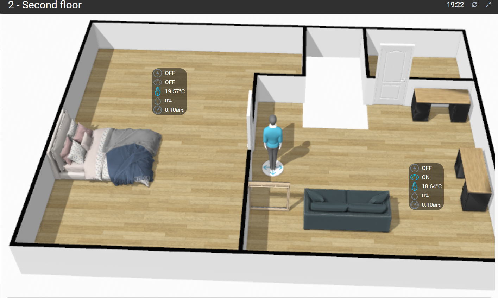
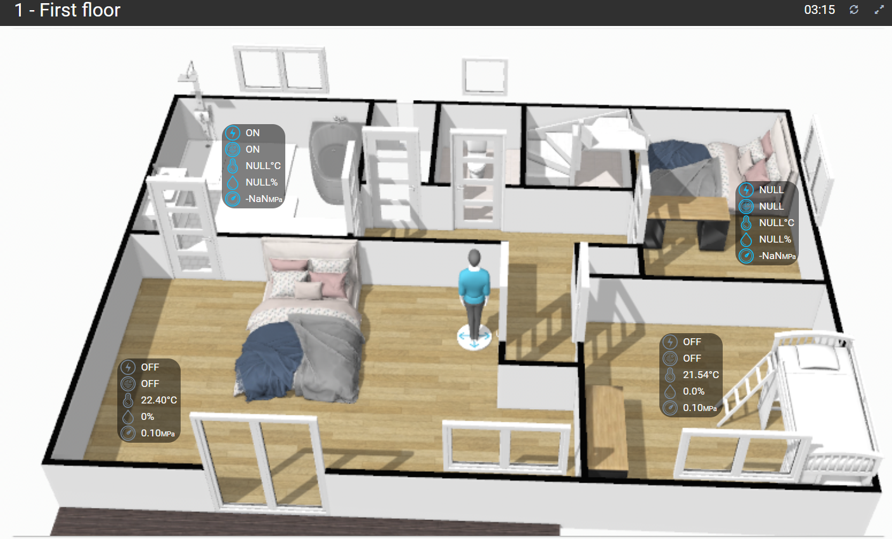
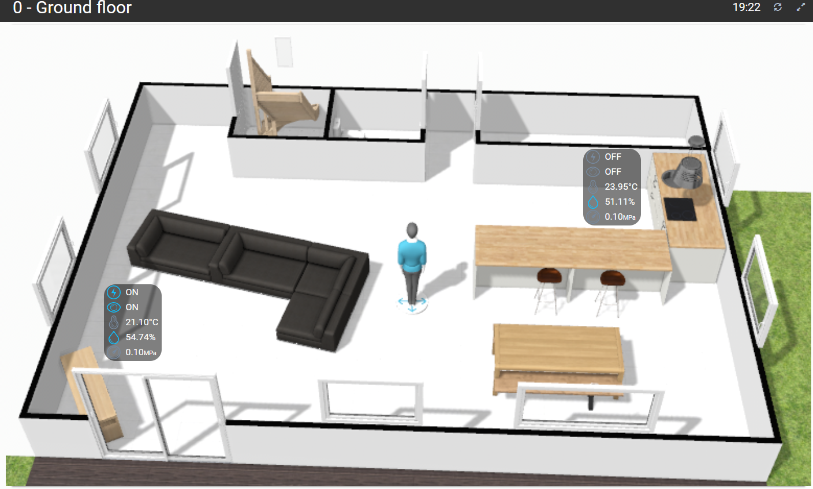
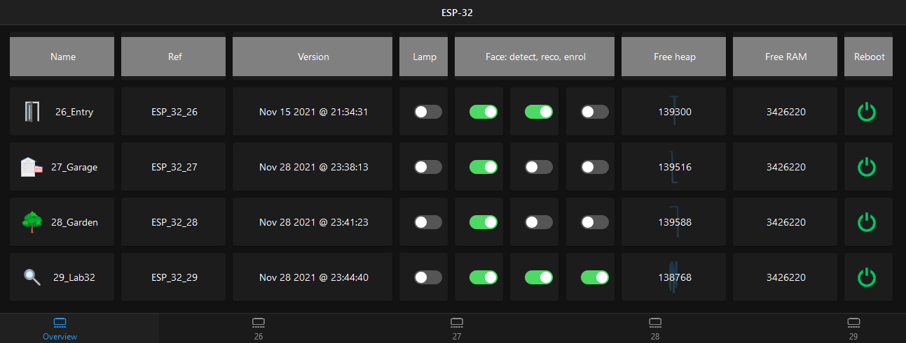
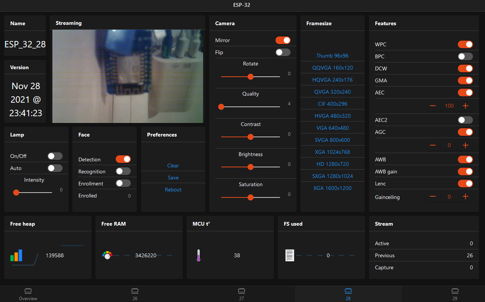
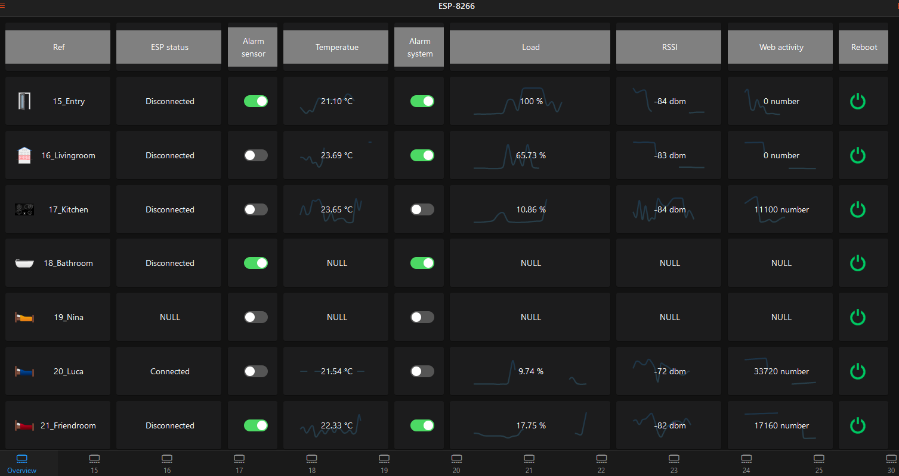
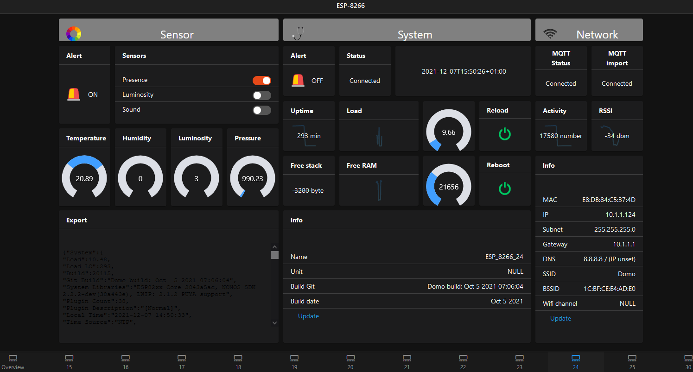

# OH3_Provisioner
Tools to provision [OpenHab3](https://www.openhab.org/blog/2020-12-21-openhab-3-0-release.html) with Things, Items and their Links and Rules.




As example, ESP 32 and 8266 templates are provided to provide the following feature:
1. ESP-32: **Web cam**
    >  
2. ESP-8266: **Sensors** (temperature, luminosity, humidity, sound, presence, motion, water pump, sole moisture)
    >  
3. ESP-8266-RFID: **RFID**
    > 

## PreRequisite
[Jump on the dedicated page](./doc/prerequisite.md)

## Usage
All is managed by the shell script `generate.sh`
````commandline
Used to provision OpenHAB3 via API with the help of JSON templates and to generate the template web files.
    -h | --help                           Print this help.
    -a | --action                         Which action to perform? Can be: create, update, destroy. Required.
    -c | --components                     On which component the action must be performed? Can be: all or one of things, items, links, rules. Required.
    -t | --ohtoken                        OpenHab token. Required.
    -s | --startindex                     Starting ESP index. Default: 15.
    -e | --endindex                       Ending ESP index. Default: 30.
    -i | --ippattern                      ESP IP pattern used like a prefix. Default: 10.1.1.1.
    -u | --ohurl                          OpenHab URL. Default: http://domo:8080.
    -w | --rowindex                       Starting row index to build the Overview pages. Default: 1.
    -p | --webpage <> -P | --nowebpage    Should I generate the OpenHab web pages?. Default: 0.
    -r | --runapi  <> -R | --norunapi     Should I run the API call? Default: 0.
    -d | --doitems <> -D | --nodoitems    Should I do all single items? Default: 1.
    -v | --verbose                        Display verbose traces. Default: 0
````

## What to do after?
Only the web pages must be created manually.

### OpenHab UI
Copy/paste the content of the file generated in `OpenHAB/generate` to populate the source code.

### HABPanel
Create one `template` by floor and upload the page content from the files in the folder `OpenHAB/HABPanel/*.html`.

## Default parameters
````commandline
EXEC_API=0
DO_ITEMS=1
WEB_PAGES=0
DEBUG=0

ESP_INDEX_START=15
ESP_INDEX_END=30
ESP_IP_PATTERN="10.1.1.1"

PAGE_ROW_INDEX=1

OH_WEB_URL="http://domo:8080"
OH_TOKEN=""

INPUT_DIR="./"
GENE_DIR="generate/"
API_DIR="${INPUT_DIR}OpenHAB/API/"
TMP_FILE="temp.json"
_JQ="jq"
````
