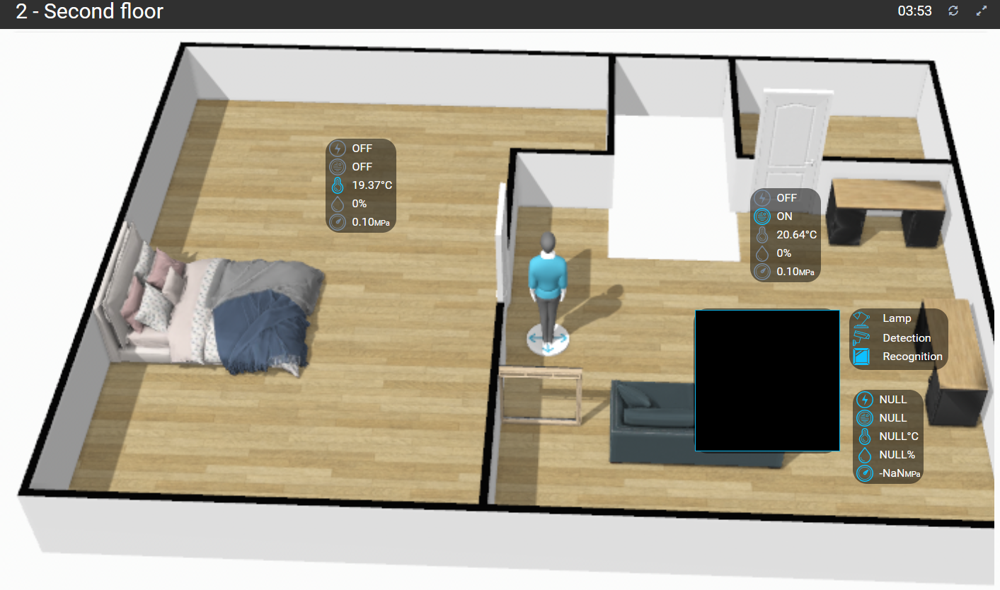
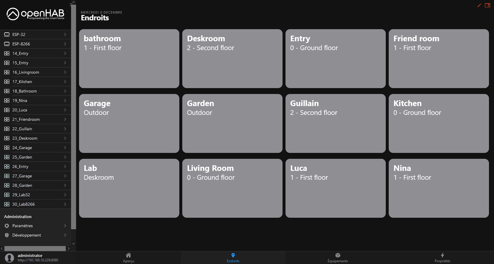
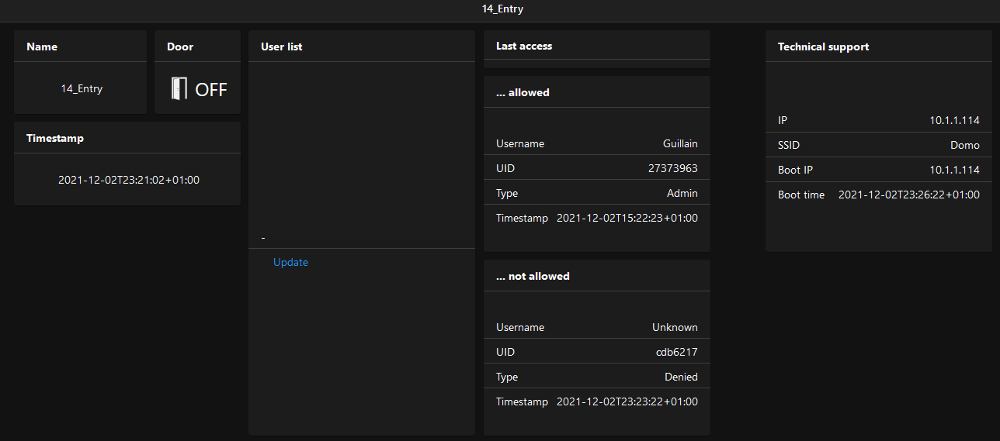

# OH3_Provisioner
Tools to provision [OpenHab3](https://www.openhab.org/blog/2020-12-21-openhab-3-0-release.html) with Things, Items and their Links and Rules.

As example, ESP 32 and 8266 setup and templates are provided with the following features:
- Web camera (streaming, control, monitoring)
- RFID (scan, enrolment, opendoor)
- Sensors (control, monitoring, alerting)
- System (monitoring, alerting)

### Frontend
<table>
    <thead>
        <tr>
            <th>Overview</th>
            <th colspan="2=">Layer</th>
        </tr>
    </thead>
    <tbody>
        <tr>
            <td rowspan=4 style="width: 40%;"></td>
            <td style="width: 10%;">Second</td>
            <td style="width: 50%;"></td>
        </tr>
        <tr>
            <td>First</td>
            <td></td>
        </tr>
        <tr>
            <td>Ground</td>
            <td></td>
        </tr>
        <tr>
            <td>Outdoor</td>
            <td></td>
        </tr>
    </tbody>
</table>

### Backend
<table style="width: 100%;">
    <thead>
        <tr>
            <th>Overview</th>
            <th colspan="4=">Layer</th>
        </tr>
    </thead>
    <tbody>
        <tr>
            <td rowspan=4 style="width: 30%;">
               
               
               
            </td>
            <td style="width: 3%;"><b>Hardware</b></td>
            <td style="width: 7%;"><b>Usage</b></td>
            <td style="width: 30%;"><b>Overview</b></td>
            <td style="width: 30%;"><b>Single page</b></td>
        </tr>
        <tr>
            <td>ESP-32</td>
            <td>Web cam</td>
            <td></td>
            <td></td>
        </tr>
        <tr>
            <td>ESP-8266</td>
            <td>Sensors (temperature, luminosity, humidity, sound, presence, motion, water pump, sole moisture)</td>
            <td></td>
            <td></td>
        </tr>
        <tr>
            <td>ESP-8266-RFID</td>
            <td>RFID</td>
            <td></td>
            <td></td>
        </tr>
    </tbody>
</table>

## [PreRequisite](./doc/prerequisite.md)

## [Usage](./doc/usage.md)
All is managed by the shell script `generate.sh`
````commandline
Used to provision OpenHAB3 via API with the help of JSON templates and to generate the template web files.
    -h | --help                           Print this help.
    -a | --action                         Which action to perform? Can be: create, update, destroy. Required.
    -c | --components                     On which component the action must be performed? Can be: all or one of things, items, links, rules. Required.
    -t | --ohtoken                        OpenHab token. Required.
    -s | --startindex                     Starting ESP index. Default: 15.
    -e | --endindex                       Ending ESP index. Default: 30.
    -i | --ippattern                      ESP IP pattern used like a prefix. Default: 10.1.1.1.
    -u | --ohurl                          OpenHab URL. Default: http://domo:8080.
    -w | --rowindex                       Starting row index to build the Overview pages. Default: 1.
    -p | --webpage <> -P | --nowebpage    Should I generate the OpenHab web pages?. Default: 0.
    -r | --runapi  <> -R | --norunapi     Should I run the API call? Default: 0.
    -d | --doitems <> -D | --nodoitems    Should I do all single items? Default: 1.
    -v | --verbose                        Display verbose traces. Default: 0
````

## [What to do after?](./doc/next.md)

## [Default parameters](./doc/default_parameters.md)

## [Infrastructure](./doc/infrastructure.md)

## [Links](./doc/links.md)

## [Tree](./doc/tree.md)
